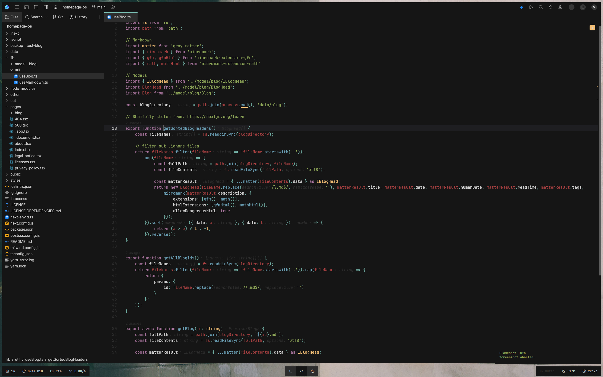

# Base16 Classic Dark

This is my personal take on the `Base16 Classic Dark` theme for JetBrains Fleet IDE. It is based on a `Base16 Classic Dark` color scheme I used for a long time for all my systems. I have made some changes to the original color scheme to make it more suitable for my needs.

## Color Palette

| Color   | Hex       |
| ------- | --------- |
| Black   | `#151515` |
| Red     | `#ac4142` |
| Green   | `#90a959` |
| Yellow  | `#f4bf75` |
| Blue    | `#6a9fb5` |
| Magenta | `#aa759f` |
| Cyan    | `#75b5aa` |
| White   | `#d0d0d0` |

## Installation

Add the JSON file to the Fleet themes directory, which is usually located at `~/.fleet/themes/`.
